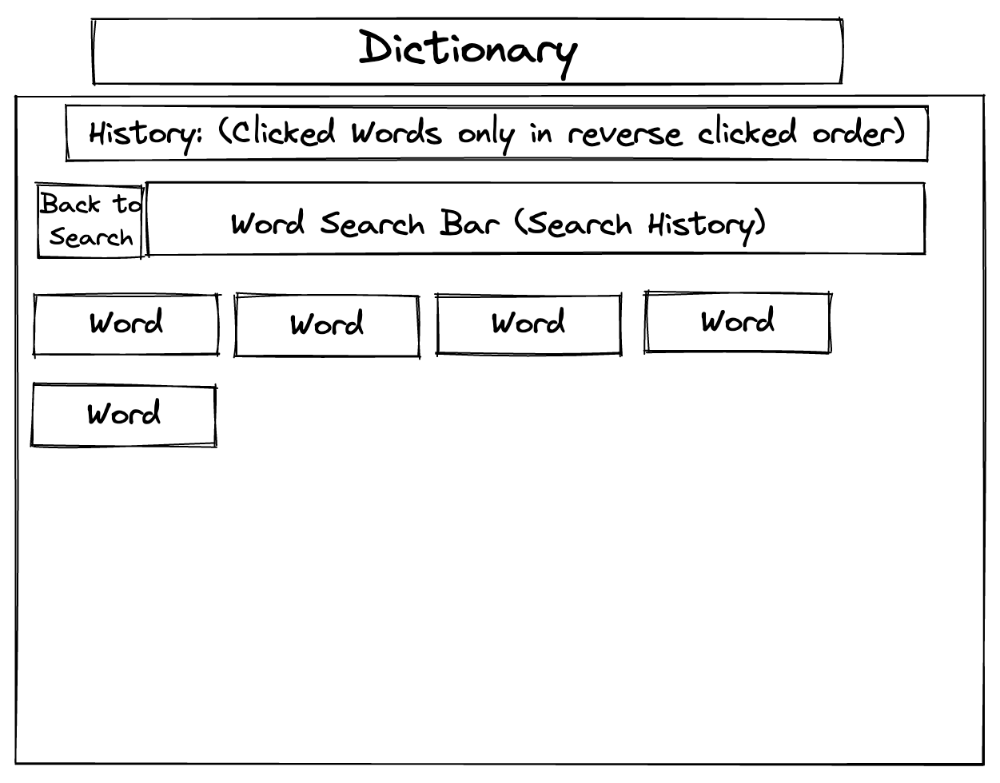
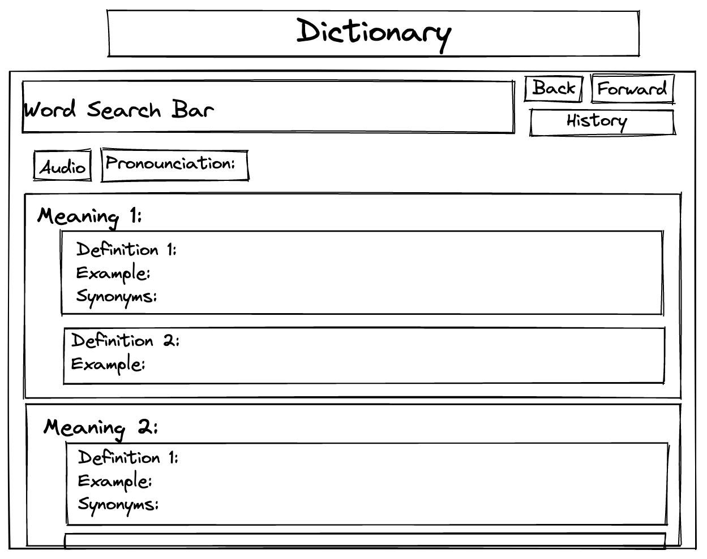

# Diction-Airy


## Project Overview

Diction-Airy was my second project for General Assembly’s Software Engineering Course. It was pair-coded in 48 hours, ‘Hackathon’ style, with Tarik Canessa Wright.

Diction-Airy is a single page application that searches a dictionary API as you type. Every word on the page is clickable and leads to another definition, and previous searches can be recalled using a history function. We envisioned it as a bit of a rabbit hole for users, with a user-friendly UI that makes searching for words fun and engaging.

It is deployed using Netlify and available here.

## Brief

Build a React application that consumes a public API, pair-coded in 48 hours.

## Technologies Used

* React.js
* JavaScript
* HTML5
* SCSS
* Bulma CSS Framework
* Insomnia REST Client
* Axios
* Free Dictionary API

## Process

We settled on the idea of using a Dictionary API fairly quickly - as the project had a very quick turnaround we needed something that was easy to use and didn’t want to make getting the necessary data a bottleneck so early in the project.

The vast majority of the project was coded together - methodically working through the problems step by step and helping each other with solutions.




Once we had completed our wireframes we set about building the search bar that would form the basis of our app. We set it up so that we would call the API for a word definition every time the value in the search bar changed - we didn’t want a search button, we wanted it to look dynamic and non-static. If the user has typed nothing or deleted their search, we set it to search for the definition of ‘dictionary’. This ensured the page was full of information all the time, and we didn’t have to deal with the eventuality of a barren page.

```javascript 
function Input({ setData, isHistoryPage, setIsHistoryPage,  wordHistory, setWordHistory }) {
  const handleChange = async (e) => {
    let search = e.target.value
    if (search === '') {
      search = 'dictionary'
    }
```


We implemented the search function fairly early on, which was reassuring as we realised all we had to do was build additional functionality on top. The complexity and challenge of the project would be in our ability to iterate on and finesse what we’d built.

We wanted every word displayed on the screen to be a clickable link to a new word definition, which seemed an easy enough task when conceived. However we didn’t consider the many edge cases - apostrophes and punctuation were breaking our searches, and there were a lot of them. 

We dealt with this by first stripping the output of the API call into an array of words separated by spaces - this meant every word was represented by its own clickable div. When a word is clicked, it’s then split into an array of letters and each letter is checked against its ASCII value to see whether it’s punctuation or alphabetical. 

```javascript 
 // Cuts out surrounding punctuation to get the word and updates page with it
  const handleLink = (e) => {
    const word = e.target.textContent
    const letters = word.split('')
    
    // Checking punctuation with ascii
    const isLetters = letters.map(letter => {
      const asciiValue = letter.charCodeAt(0)
      if (
        (asciiValue >= 65 && asciiValue <= 90) || 
        (asciiValue >= 97 && asciiValue <= 122)) {
        return (true)
      }
      return (false)
    })
```

This information is then used to strip the punctuation from the word so it can be successfully requested from the dictionary API. Using a similar method, we also formatted the first and last word of each sentence as the data from the API was inconsistent with its use of punctuation and capitalisation.

```javascript 
   // Finding where the punctuation stops on either side of the word
    let firstLetterPosition = 0
    for (let i = 0; i < isLetters.length; i++) {
      if (isLetters[i] === true) {
        firstLetterPosition = i
        i = isLetters.length
      }
    }
    let lastLetterPosition = isLetters.length
    for (let i = isLetters.length; i >= 0; i--) {
      if (isLetters[i] === true) {
        lastLetterPosition = i + 1
        i = -1
      }
    }
    const trueWord = word.slice(firstLetterPosition, lastLetterPosition)
    return handleClick(trueWord)
  }
```


## Challenges

One of the stretch goals of our project was a history function - keeping track of all searched words and clicked definitions. We quickly abandoned the idea of making searched words part of the history function - as the API is called every time the search bar changes it meant the history would be littered with unintended searches. We could have dealt with this with a function that determined what constitutes an intended search - but that was ultimately beyond the scope of our project and seemed like a project in itself.

Our solution to creating a history function was to send every successfully clicked word into an array of words. The hard part was actually navigating backwards and forwards through the words themselves. We settled on using a pointer variable that would keep track of the index number of your current place in the history array, and allow you to traverse the list. This was probably our biggest challenge - the leap from logic to working code took more than a few iterations!

```javascript 
 const handleMove = async (e) => {
    let direction = 0
    switch (e.target.textContent) {
      case 'Back':
        (wordHistory.pointer > 0) ? direction = -1 : ''
        break
      case 'Forward':
        (wordHistory.pointer < wordHistory.words.length - 1) ? direction = 1 : ''
        break
    }
    if (direction !== 0) {
      const newPointer = wordHistory.pointer + direction
      setWordHistory({ ...wordHistory, pointer: newPointer })
      try {
        const response = await getWord(wordHistory.words[newPointer])
        setData(response.data)
        setIsHistoryPage(false)
      } catch (err) {
        return false
      } 
    }
  }
```

## Wins

In addition to our hard-won history function, I was very proud of the look and feel of our application. The framework of our idea was fairly simple and implemented quickly - but we did our best to polish what we had and make the search experience intuitive and fun to use. For example, scrolling over the words changes the background colour behind the word - if you click on a word the dictionary doesn’t have a definition for, the background turns red. Our dealing with the edge cases and compensating for the inconsistencies in the data produced by the API helped us deliver a more impressive and polished application.

## Styling

We used the Bulma CSS Framework to help us with styling so we could spend more time focusing on the core logic of our application. We used thick lines and primary colours on white, which lent it a modern, utilitarian look.

## Future Content and Improvements

* Our finished project is fully responsive but the UI could be a bit cleaner in mobile view.
* Implementing a favourites button.
* Explore the possibility of storing word history in local storage.

## Key Learnings

I felt I got a lot from the experience of coding as a pair. I found Tarik pushed me, confident in implementing features I may have shied away from implementing on my own in the short timeframe. I found the process of being able to talk through the code with someone extremely beneficial, and we were able to bring different things to the table and see things that the other person couldn’t.
